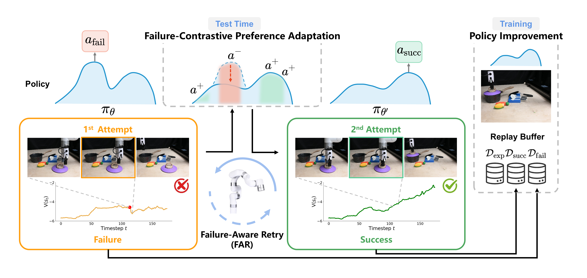

## FAR: Failure-Aware Retry for Test-Time Recovery and Continual Policy Improvement 

### [Paper](https://arxiv.org/pdf/2607.01111) | [Project Page](https://hoar012.github.io/FAR-Project/)

## News
- **2026.9.4** FAR has been accepted to CoRL 2026!🎉🎉

## Failure-Aware Retry

|  |
|:--:|
| After a failure, FAR identifies failure-inducing actions using value estimation, then updates the policy with both failure examples and alternative positive examples. The collected trajectories are added to the replay buffer for continual policy improvement. |

Visit our [Project Page](https://hoar012.github.io/FAR-Project/) for video demostrations.

## BibTeX

```bibtex
@misc{hao2026far,
      title={FAR: Failure-Aware Retry for Test-Time Recovery and Continual Policy Improvement}, 
      author={Haoran Hao and Shahram Najam Syed and Jeffrey Ichnowski and Jeff Schneider},
      year={2026},
      eprint={2607.01111},
      archivePrefix={arXiv},
      primaryClass={cs.RO},
      url={https://arxiv.org/abs/2607.01111}, 
}
```